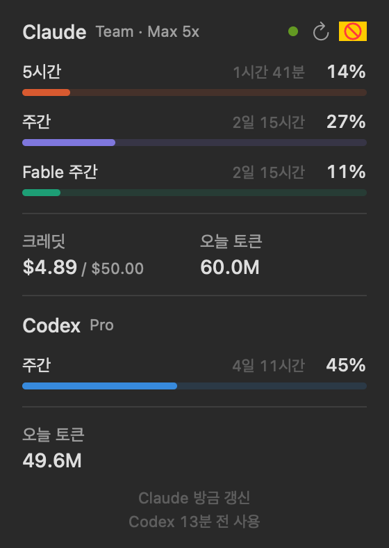

# Claude Usage Widget

Claude Code 구독 플랜 사용량(5시간 · 주간 · 모델별 한도)을 늘 보이는 곳에 띄워 두는 작은 도구입니다. **Windows**와 **macOS**를 지원하고, macOS 버전은 **Codex** 사용량도 함께 보여 줍니다.

<br>
 

## 플랫폼

| | Windows | macOS |
|---|---|---|
| 형태 | 바탕화면 카드 위젯 + 작업표시줄 요약 | 메뉴바 항목 + 드롭다운 패널 |
| 보여 주는 서비스 | Claude Code | Claude Code, Codex(ChatGPT 앱·CLI·VS Code 확장) |
| 구현 | Windows PowerShell 5.1 + WinForms (추가 설치 없음) | Swift / SwiftUI, macOS 14 이상 |
| 설치 | 원본 저장소 [Releases](https://github.com/hideface/ClaudeUsageWidget/releases)의 설치 파일 | 공유받은 zip, 또는 소스에서 빌드 |
| 문서 | [windows/README.md](windows/README.md) | [macos/README.md](macos/README.md) · [설치·사용 가이드](macos/docs/GUIDE.md) |

## 공통 기능

- 5시간 · 주간 · 모델별 주간 한도(%)와 리셋까지 남은 시간, 지금 먼저 걸리는 한도 강조
- 추가 사용 크레딧(이번 달 사용액 / 월 한도), 오늘 쓴 토큰(로컬 세션 로그 집계)
- 알림: 85% 경고, 95% 위험, 100% 도달, 사용 속도 예측, 크레딧 사용 시작
- 기본 / 작게(가로 막대) 보기, 클릭으로 남은 시간 ↔ 리셋 시각 전환
- 사용량 API 호출 제한(429) 시 5 → 10 → 20 → 30분 대기, 재시작해도 이어받음

## 플랫폼별 차이

| | Windows | macOS |
|---|---|---|
| Claude 토큰 | `%USERPROFILE%\.claude\.credentials.json`. 만료되면 위젯이 refresh token으로 직접 갱신해 다시 저장(메뉴에서 끌 수 있음) | 키체인에서 **읽기만** 함. 만료되면 Claude Code CLI가 스스로 갱신하게 함(설정의 "CLI 토큰 자동 갱신", 기본 꺼짐) |
| 토큰 만료 중 표시 | 마지막 값 | Claude 데스크톱 앱 기록, 리셋 시각 계산·추정, 마지막 값 순으로 대체 |
| Codex | — | 로컬 로그에서 한도·오늘 토큰(로그인·네트워크 불필요) |
| 상주 방식 | 바탕화면 카드(바탕화면 고정 / 일반 / 항상 위), 트레이 아이콘 | 메뉴바(형식 4종, 노치에 가려지면 자동 축소) |

## 저장소 구조

```
windows/   Windows 위젯 (PowerShell + WinForms, NSIS 설치 파일) — 원본 저장소에서 가져옴
macos/     macOS 메뉴바 앱 (Swift Package: UsageCore 라이브러리 + 앱, 단위 테스트)
```

## 출처와 관리

- Windows 위젯은 [hideface/ClaudeUsageWidget](https://github.com/hideface/ClaudeUsageWidget)에서 만들어졌고, 지금도 그곳에서 개발됩니다. 이 저장소는 원본을 포크해 Windows 업데이트를 필요할 때 가져옵니다.
- macOS 버전은 이 포크에서 새로 구현했습니다(Windows 코드를 옮긴 게 아니라 같은 동작을 Swift로 작성). 첫 버전은 원본에도 병합됐고([#1](https://github.com/hideface/ClaudeUsageWidget/pull/1)), 이후 버전(Codex, 통합 메뉴바, 토큰 만료 대응)은 이 저장소에서 관리합니다.

## 주의

- 한도 조회에 쓰는 `https://api.anthropic.com/api/oauth/usage`는 문서화되지 않은 엔드포인트라, 응답 형식이 바뀌면 동작하지 않을 수 있습니다.
- 두 앱 모두 코드 서명·공증이 없어 처음 실행할 때 OS 경고가 뜹니다(Windows SmartScreen, macOS Gatekeeper). 사내 배포 전에는 보안 담당자와 공유하길 권장합니다.
