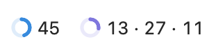
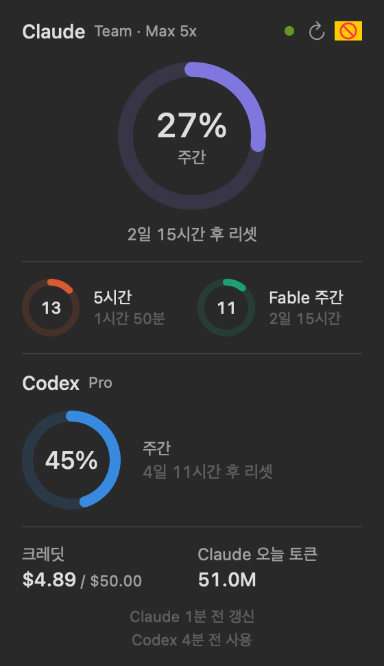

# Claude Usage Bar (macOS)

Claude Code 구독 플랜 사용량을 메뉴바에 보여 주는 macOS 앱입니다. Codex CLI를 쓰면 Codex 사용량도 함께 보여 줍니다.
이 저장소의 Windows 위젯과 같은 정보를 보여 주는 macOS 버전입니다. Windows 코드를 옮긴 게 아니라, 같은 동작을 Swift/SwiftUI로 새로 구현했습니다.

  

 

## 요구 사항

- macOS 14 이상
- Claude Code CLI에 구독 계정(Pro / Max / Team / Enterprise)으로 로그인한 적이 있을 것

## 빌드 / 실행

```bash
scripts/build-app.sh --run      # ~/Applications/ClaudeUsageBar.app 생성 후 실행
swift test                      # 단위 테스트
.build/debug/ClaudeUsageBar --snapshot out/   # 실제 데이터로 패널·메뉴바 PNG 생성
```

## 데이터 출처

| 우선순위 | 출처 | 조건 | 얻는 것 |
|---|---|---|---|
| 1 | `GET api.anthropic.com/api/oauth/usage` (비공식) | CLI 토큰이 유효할 때, 기본 3분 주기 | 리셋 시각, 모델별 한도, 크레딧 금액까지 전부 |
| 2 | 데스크톱 앱 기록 `~/Library/Application Support/Claude/plan-usage-history.json` | 토큰이 만료됐고 기록이 30분 안일 때 | 5시간·주간 % (15분 단위) |
| — | `~/.claude/projects/**/*.jsonl` | 항상, 10초 주기 | 오늘 토큰 |
| Codex | `~/.codex/sessions/**/rollout-*.jsonl`의 `token_count` 이벤트 | Codex를 쓸 때마다 CLI가 기록, 10초 주기로 확인 | Codex 한도별 5시간·주간 %, 리셋 시각 |

- 토큰은 키체인 `Claude Code-credentials`에서 `/usr/bin/security`로 **읽기만** 합니다. 앱이 토큰을 갱신하거나 다시 쓰지 않습니다. 토큰이 만료되면 터미널에서 `claude`를 실행할 때 CLI가 스스로 갱신합니다.
- 429를 받으면 5 → 10 → 20 → 30분으로 대기 시간을 늘리고, 앱을 다시 켜도 대기를 이어받습니다.
- 토큰은 디스크·로그에 남기지 않습니다(로그에서 `sk-ant-…`는 마스킹).
- Codex는 로컬 로그만 읽고 네트워크·인증을 쓰지 않습니다. 최근 8일 안에 기록된 한도만 보여 주고, 마지막 기록이 6시간보다 오래되면 회색으로 표시합니다(다른 기기에서 쓴 사용량은 이 맥의 로그에 없음).

## 기능

- Codex: 메뉴바에 Codex 항목(도넛 + 가장 높은 %)이 따로 생기고, 패널에 Codex 섹션이 붙습니다. 색은 파랑 한 가지(70%+ 주황, 90%+ 빨강). 설정에서 끌 수 있음
- 메뉴바: 형식 4종(① 도넛만 / ② 도넛 + 숫자 / ③ 미니 도넛 3개 / ④ 도넛 + 숫자 3개, 기본 ④). ③·④가 노치 뒤로 가려지면 ②로 자동 축소
- 알림: 경고(85%) · 위험(95%) · 100% 도달 · 사용 속도 예측(60분 안에 한도) · 추가 크레딧 사용. 리셋 주기마다 단계별 1회
- 설정(우클릭 또는 패널 ⋯ → 설정…): 조회 주기(2/3/5/10분), 메뉴바 형식, 로그인 시 자동 실행, 알림 기준치(80·95 / 85·95 / 90·98), 알림 테스트

## 앱 데이터

`~/Library/Application Support/ClaudeUsageBar/`: `state.json`(마지막 API 값·대기 상태), `alerts.json`(알림 기록), `app.log`(최근 200줄)

## 문서

- [docs/GUIDE.md](docs/GUIDE.md): 설치·사용·문제 해결 가이드
- [CLAUDE.md](CLAUDE.md): Claude Code로 빌드·수정할 때 참고하는 안내
