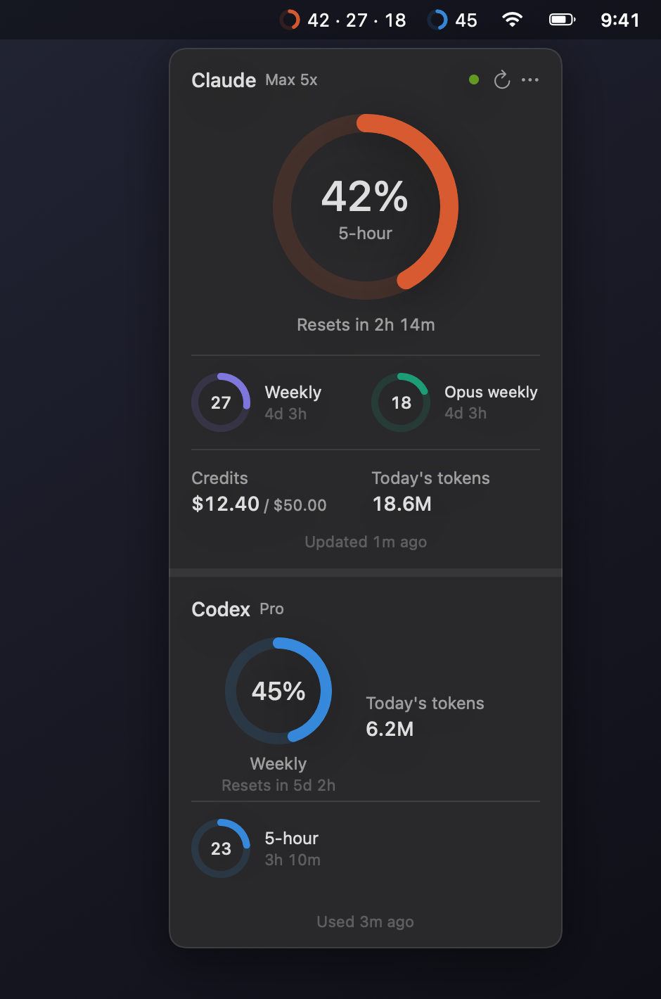
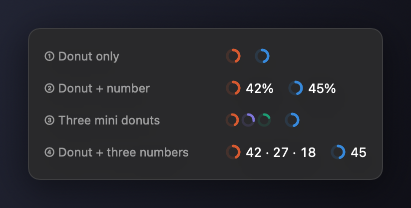
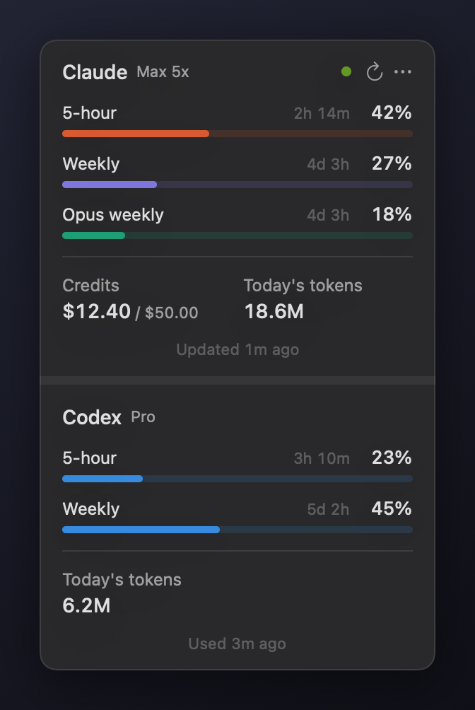
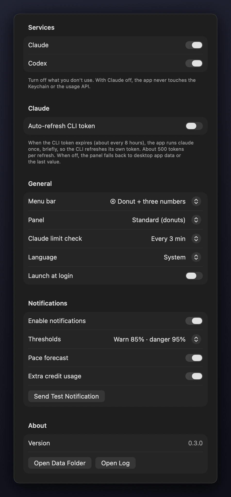

**English** | [한국어](GUIDE.ko.md)

# Claude Usage Bar user guide

Claude Usage Bar shows your Claude Code plan usage in the Mac menu bar. It draws the 5-hour, weekly and per-model limits as donuts and notifies you as you approach them. If you use Codex (in the ChatGPT app, the CLI or the VS Code extension), it shows Codex usage too.



---

## 1. Requirements

- macOS 14 (Sonoma) or later
- You have logged in to the Claude Code CLI with a **subscription account** (Pro / Max / Team / Enterprise)
  - Running `claude` in Terminal once and logging in is enough
  - With an API key only, no limits are shown (today's tokens still are)
- To build from source: Xcode 16+ or the Command Line Tools
  - If you don't have them: `xcode-select --install` in Terminal

## 2. Install

Pick whichever of the three ways suits you.

### Option A. Let Claude Code do it (recommended)

Ask Claude Code (`claude` in Terminal, or the Code tab in the desktop app):

> Clone https://github.com/Jung-Soo/ClaudeUsageWidget, then build and run the menu bar app in the macos folder

The repository's `CLAUDE.md` explains how to build, run and diagnose the app, so Claude Code reads it and takes care of the rest. It will also tell you how to install build tools if they are missing.

### Option B. From Terminal

```bash
git clone https://github.com/Jung-Soo/ClaudeUsageWidget.git
```

```bash
cd ClaudeUsageWidget/macos && scripts/build-app.sh --run
```

- The app is installed to `~/Applications/ClaudeUsageBar.app` and launched
- An app you built on your own Mac opens without a security warning

### Option C. Use an app a colleague built

The person who built it zips it in a way that keeps the signature intact:

```bash
ditto -c -k --keepParent ~/Applications/ClaudeUsageBar.app ClaudeUsageBar.zip
```

The recipient then:

1. Unzips it and moves `ClaudeUsageBar.app` to the Applications folder
2. Double-clicks it. The app has no Apple-issued signature, so **macOS blocks the first launch**
3. Clicks **"Open Anyway"** at the bottom of **System Settings → Privacy & Security** (only once)
   - Or in Terminal: `xattr -dr com.apple.quarantine /Applications/ClaudeUsageBar.app`

A personal build zipped with `ditto` runs only on the same kind of Mac it was built on (Apple Silicon or Intel). The zip shared for colleagues is a universal build that runs on both.

## 3. Using it

### Menu bar

`◔ 13 · 27 · 11   ◔ 45`  (Claude on the left, Codex on the right; only enabled services appear)

- **Claude donut**: usage of the limit you are on now (the one you will hit first)
- **Claude numbers**: 5-hour · weekly · per-model weekly (the highest), in %
- **Codex donut and number** (blue): the highest of the Codex limits
- Hover to see what each number means
- If the menu bar runs out of room and the item hides behind the notch, the Claude part shrinks to `◔ 27%` automatically
- Choose one of four styles in Settings



### Panel (click the menu bar item)

One section per enabled service: Claude on top, Codex below a light band.

- **Claude section**: big donut (current limit), small donuts (other limits), credits (spent this month / monthly cap), today's tokens
- **Codex section**: donut (highest limit), small donuts if there are several limits, today's tokens
- Click a donut or bar to switch between **time left and reset time** ("Resets 9/30 (Wed) 04:00")
- Hover over today's tokens to see the input / output / cache breakdown
- **The last line of each section** tells you how fresh that service's values are and what is wrong, if anything (see section 5)
- ⟳ refreshes now; ⋯ opens Settings, the data folder, or quits
- Settings → Panel → **Compact** shows one horizontal bar per limit instead of donuts



### About the Codex values

- The app reads the limits and tokens Codex writes to its logs as you use it. No login or network needed
- Codex in the ChatGPT app, the Codex CLI and the VS Code extension all write the same logs, so usage from any of them shows up
- Limit % is the **account-wide value** reported by the Codex server, so app and CLI usage are not added together. Today's tokens add up every session on this Mac
- The main limit stays visible even after long idle periods and shows "Reset (est.)" 0% once its reset has passed. Extra per-model limits are hidden after 8 days without use
- With an API key there are no plan limits, so only today's tokens are shown
- After 6 hours without use the values turn gray and read "Last data N h ago". They update when you use Codex again
- Codex usage on other devices (another Mac, the web) is not in this Mac's logs, so it is not reflected until you use Codex here again

### Colors

| Color | Meaning |
|---|---|
| Coral / purple / teal | Claude 5-hour / weekly / per-model weekly (normal) |
| Blue | Codex (all limits) |
| Orange | 70% or more |
| Red | 90% or more |
| Gray | Not current (fetch failed or waiting) |

### Right-click menu

Refresh Now · Settings… · Open Data Folder · Quit

## 4. Settings (right-click → Settings…)



| Setting | Description |
|---|---|
| Services | Turn Claude and Codex on or off. Initially only what is installed is on. If you use just one, turn the other off |
| Auto-refresh CLI token | Off by default. When on, the app briefly runs `claude` whenever the CLI token expires (about every 8 hours) so the CLI refreshes itself. About 500 tokens per refresh; works during sleep too. **Recommended if you rarely use `claude` in Terminal and mostly use the desktop app.** The desktop app sometimes writes no usage data for more than a day even while running, so with this off the values can stay frozen for a long time |
| Menu bar | ① Donut only / ② Donut + number / ③ Three mini donuts / ④ Donut + three numbers (default) |
| Panel | Standard (donuts) / Compact (bars) |
| Claude limit check | Every 2 / 3 / 5 / 10 minutes (default 3). Too short and you hit the rate limit (429) |
| Language | System (default) / English / 한국어. The app restarts when you change it |
| Launch at login | Starts the app when you log in |
| Notifications | Warning/danger thresholds (80·95 / 85·95 / 90·98), pace forecast, extra credit usage |
| Send Test Notification | The first time, macOS asks for permission. Allow it, or no notifications will appear |

### Notification types

- **Warning (85%)** / **Danger (95%)** / **100% reached**: once per stage per reset cycle
- **Pace forecast**: when the current pace would reach the limit within 60 minutes ("At this pace, 5-hour limit in ~30 min")
- **Extra credits**: when paid credits start being used beyond the limit (at most once every 30 minutes)

## 5. Status line messages and what to do

| Message | Meaning | What to do |
|---|---|---|
| `Updated 3m ago` | Normal | Nothing |
| `Desktop app data · 5m ago` | The CLI token expired, so the panel shows data written by the Claude desktop app (15-minute steps). Per-model limits are gray | Run `claude` in Terminal once for exact values |
| `~` before a reset time (e.g. ~42m) | 5-hour reset estimated from desktop data (usually within ±15 minutes) | Nothing. It becomes exact once you use `claude` |
| `Reset (est.)` with 0% | The reset time has passed, so it is assumed to be 0%. If you used Claude elsewhere (e.g. the web) in the meantime, the real value may differ | Nothing |
| `Using an API key · counting today's tokens only` | No subscription login, API key only. There are no 5-hour or weekly limits | Nothing |
| `CLI token expired · run claude in Terminal to refresh` | The token expired and there is no recent desktop app data (the desktop app writes it only sporadically) | Run `claude` in Terminal (reflected within a minute), or turn on Settings → Auto-refresh CLI token |
| `Auto refresh failed · …` | Auto-refresh is on, but the CLI was not found or failed to run | Check your login with `claude` in Terminal. Transient failures (network, etc.) are retried starting at 2 minutes with growing intervals; if the CLI was not found, the app checks again every 30 minutes |
| `Log in to the Claude Code CLI` | No login information | Run `claude` in Terminal and log in |
| `Auth failed · log in again with claude in Terminal` | The token was rejected | Run `/login` in `claude` |
| `Rate limited · retry in 10m` | The usage API rate limit (429) | Wait; it retries automatically. A longer check interval makes this rarer |
| `Fetch failed (response format changed)` | Anthropic changed the undocumented API format | The app needs an update (section 6) |

- For security, this app **never refreshes the token itself.** While you use the Claude Code CLI it keeps the token fresh, so if you mostly use the desktop app, "Desktop app data" mode is normal

## 6. Working on it with Claude Code

Beyond installing, hand problems or changes to Claude Code. Open Claude Code in the source folder (`ClaudeUsageWidget/macos`) and ask.

| Situation | Ask |
|---|---|
| Update to the latest version | "Pull the latest source, rebuild and run it" |
| Odd values or an error message | "The menu bar app says 'Fetch failed'. Check app.log and find the cause" |
| The API format seems to have changed | "The usage API response format seems to have changed. Check the response structure and update the app" |
| See the UI | "Show me what the panel looks like now using snapshot mode" |
| Change a feature | "Add 75/90 to the notification thresholds" |

Claude Code reads the repository's `CLAUDE.md` before working. It includes rules against printing token values on screen or in logs.

## 7. What the app does (for security review)

| Reads | Purpose |
|---|---|
| Keychain `Claude Code-credentials` (read-only via `/usr/bin/security`) | Token for the usage request |
| `~/.claude/projects/**/*.jsonl` | Today's tokens |
| `~/Library/Application Support/Claude/plan-usage-history.json` | Fallback while the token is expired |
| `~/.codex/sessions/**/rollout-*.jsonl` (only the tail of recent files) | Codex limits |

- The **only** network request is `https://api.anthropic.com/api/oauth/usage` (every 3 minutes by default)
- Tokens are never written to disk, logs or the Keychain
- An unsigned app reading the Keychain and calling an external API may trigger warnings from company security tools (EDR)

## 8. Uninstall

1. Right-click → Quit
2. If you turned on "Launch at login", turn it off first (or remove it under System Settings → General → Login Items)
3. Delete the app and its data:

```bash
rm -rf ~/Applications/ClaudeUsageBar.app ~/Library/Application\ Support/ClaudeUsageBar && defaults delete io.github.claudeusagebar.ClaudeUsageBar
```
