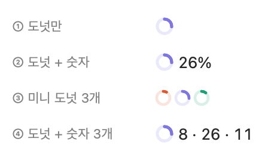
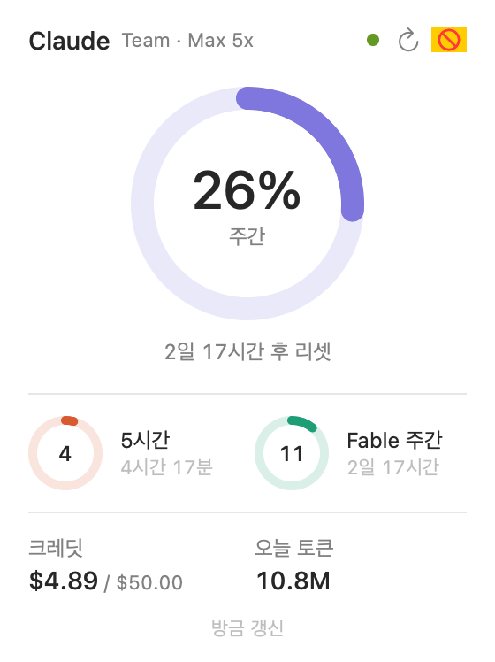
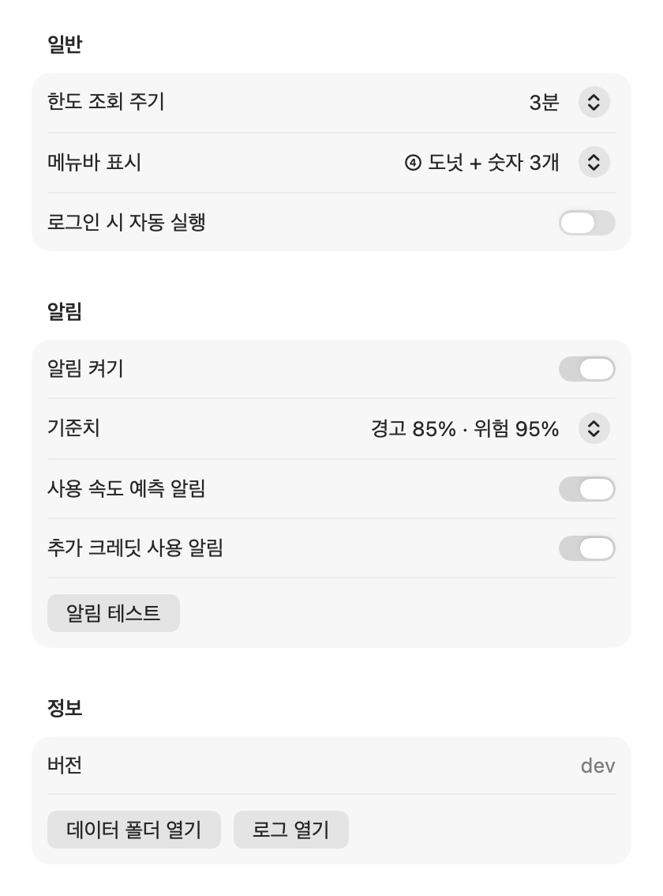

# Claude Usage Bar 사용 가이드

Claude Code 구독 플랜 사용량을 맥 메뉴바에 보여 주는 앱입니다. 5시간·주간·모델별 한도를 도넛으로 보여 주고, 한도에 가까워지면 알림을 보냅니다.

 

---

## 1. 준비물

- macOS 14(Sonoma) 이상
- Claude Code CLI에 **구독 계정**(Pro / Max / Team / Enterprise)으로 로그인한 적이 있을 것
  - 터미널에서 `claude`를 한 번이라도 실행해 로그인했으면 됩니다
  - API 키로만 쓰는 경우 한도는 표시되지 않습니다(오늘 토큰은 표시됨)
- 소스에서 빌드할 때: Xcode 16 이상 또는 Command Line Tools
  - 없으면 터미널에서 `xcode-select --install`

## 2. 설치

아래 세 방법 중 편한 것을 고르세요.

### 방법 A. Claude Code에게 맡기기 (권장)

Claude Code(터미널 `claude` 또는 데스크톱 앱의 Code 탭)에 아래처럼 요청합니다.

> https://github.com/hideface/ClaudeUsageWidget 을 클론해서 macos 폴더의 메뉴바 앱을 빌드하고 실행해줘

저장소의 `CLAUDE.md`에 빌드·실행·문제 진단 방법이 들어 있어서, Claude Code가 이를 읽고 알아서 진행합니다. 빌드 도구가 없으면 설치 방법도 안내해 줍니다.

### 방법 B. 터미널에서 직접

```bash
git clone https://github.com/hideface/ClaudeUsageWidget.git
```

```bash
cd ClaudeUsageWidget/macos && scripts/build-app.sh --run
```

- 앱이 `~/Applications/ClaudeUsageBar.app`에 설치되고 바로 실행됩니다
- 자기 맥에서 직접 빌드한 앱은 보안 경고 없이 바로 열립니다

### 방법 C. 동료가 빌드한 앱을 받아서

빌드한 사람이 서명이 깨지지 않게 zip으로 묶어 전달합니다.

```bash
ditto -c -k --keepParent ~/Applications/ClaudeUsageBar.app ClaudeUsageBar.zip
```

받은 사람은:

1. zip을 풀고 `ClaudeUsageBar.app`을 응용 프로그램 폴더로 옮깁니다
2. 더블클릭합니다. Apple 인증 서명이 없는 앱이라 **처음에는 실행이 막힙니다**
3. **시스템 설정 → 개인정보 보호 및 보안** 아래쪽의 **"그래도 열기"**를 누릅니다(한 번만 하면 됨)
   - 또는 터미널에서: `xattr -dr com.apple.quarantine /Applications/ClaudeUsageBar.app`

주의: 이 방법으로 받은 앱은 **Apple Silicon 맥 전용**입니다(Intel 맥은 방법 A나 B로 직접 빌드).

## 3. 사용법

### 메뉴바

`◔ 8 · 26 · 11`

- **도넛**: 지금 걸려 있는 한도(가장 먼저 막힐 한도)의 사용률
- **숫자**: 5시간 · 주간 · 모델별 주간(가장 높은 것) 순서의 %
- 마우스를 올리면 각 숫자의 이름이 툴팁으로 보입니다
- 메뉴바 공간이 부족해 노치 뒤로 숨겨지면 `◔ 26%`로 자동으로 줄어듭니다

### 패널 (도넛 클릭)

- **큰 도넛**: 지금 걸린 한도와 리셋까지 남은 시간
- **작은 도넛**: 나머지 한도
- **크레딧**: 추가 사용 크레딧 이번 달 사용액 / 월 한도
- **오늘 토큰**: 오늘 쓴 토큰 합계(마우스를 올리면 입력·출력·캐시 분해)
- **맨 아래 줄**: 값이 언제 기준인지, 문제가 있으면 무슨 문제인지(아래 5장)
- ⟳ 지금 갱신, ⋯ 설정·데이터 폴더·종료

### 색의 의미

| 색 | 의미 |
|---|---|
| 코랄 / 보라 / 청록 | 5시간 / 주간 / 모델별 주간 (평상시) |
| 주황 | 70% 이상 |
| 빨강 | 90% 이상 |
| 회색 | 최신 값이 아님(조회 실패·대기 중) |

### 우클릭 메뉴

지금 갱신 · 설정… · 데이터 폴더 열기 · 종료

## 4. 설정 (우클릭 → 설정…)



| 항목 | 설명 |
|---|---|
| 한도 조회 주기 | 2 / 3 / 5 / 10분(기본 3분). 너무 짧으면 호출 제한(429)에 걸립니다 |
| 메뉴바 표시 | ① 도넛만 / ② 도넛 + 숫자 / ③ 미니 도넛 3개 / ④ 도넛 + 숫자 3개(기본) |
| 로그인 시 자동 실행 | 맥을 켤 때 자동으로 실행 |
| 알림 | 경고·위험 기준치(80·95 / 85·95 / 90·98), 사용 속도 예측, 추가 크레딧 사용 알림 |
| 알림 테스트 | 처음 누르면 macOS가 알림 허용을 묻습니다. 허용해야 알림이 옵니다 |

### 알림 종류

- **경고(85%)** / **위험(95%)** / **100% 도달**: 리셋 주기마다 단계별로 한 번씩
- **사용 속도 예측**: 지금 속도라면 60분 안에 한도에 닿을 때("이 속도면 약 30분 뒤 5시간 한도")
- **추가 크레딧 사용**: 한도를 넘어 유료 크레딧이 쓰이기 시작하면(30분에 최대 한 번)

## 5. 맨 아래 줄 메시지와 대처

| 메시지 | 뜻 | 할 일 |
|---|---|---|
| `3분 전 갱신` | 정상 | 없음 |
| `데스크톱 앱 기록 · 5분 전` | CLI 토큰이 만료돼, Claude 데스크톱 앱이 남긴 기록(15분 단위)으로 표시 중. 모델별 한도는 회색 | 정확한 값을 원하면 터미널에서 `claude`를 한 번 실행 |
| `CLI 토큰 만료 · 터미널에서 claude를 실행하면 갱신돼요` | 토큰이 만료됐고 데스크톱 앱 기록도 없음 | 터미널에서 `claude` 실행(1분 안에 반영) |
| `Claude Code CLI 로그인이 필요해요` | 로그인 정보가 없음 | 터미널에서 `claude` 실행 후 로그인 |
| `인증 실패 · 터미널에서 claude 다시 로그인` | 토큰이 거부됨 | `claude`에서 `/login` |
| `호출 제한 · 10분 뒤 재시도` | 사용량 조회 API 호출 제한(429) | 기다리면 자동 재시도. 조회 주기를 늘리면 덜 걸림 |
| `조회 실패(응답 형식 변경)` | Anthropic이 비공식 API 형식을 바꿈 | 앱 업데이트 필요(6장) |

- 이 앱은 보안을 위해 **토큰을 직접 갱신하지 않습니다.** Claude Code CLI를 쓰는 동안에는 CLI가 알아서 갱신하므로, 데스크톱 앱만 쓰다 보면 "데스크톱 앱 기록" 모드가 되는 게 정상입니다

## 6. Claude Code로 활용하기

설치 외에도 문제가 생기거나 바꾸고 싶은 게 있을 때 Claude Code에게 맡기면 됩니다. 소스 폴더(`ClaudeUsageWidget/macos`)에서 Claude Code를 열고 요청하세요.

| 상황 | 이렇게 요청 |
|---|---|
| 최신 버전으로 업데이트 | "최신 소스로 pull 받아서 다시 빌드하고 실행해줘" |
| 값이 이상하거나 오류 메시지 | "메뉴바 앱이 '조회 실패'라고 나와. app.log 보고 원인 찾아줘" |
| API 형식이 바뀐 것 같을 때 | "사용량 API 응답 형식이 바뀐 것 같아. 응답 구조를 확인해서 앱을 맞춰줘" |
| 화면 확인 | "스냅샷 모드로 지금 패널이 어떻게 보이는지 보여줘" |
| 기능 변경 | "알림 기준치에 75/90도 추가해줘" |

Claude Code는 저장소의 `CLAUDE.md`를 읽고 작업합니다. 토큰 값을 화면이나 로그에 출력하지 않도록 거기에 규칙이 적혀 있습니다.

## 7. 앱이 하는 일 (보안 참고)

| 읽는 것 | 용도 |
|---|---|
| 키체인 `Claude Code-credentials` (`/usr/bin/security`로 읽기 전용) | 사용량 조회용 토큰 |
| `~/.claude/projects/**/*.jsonl` | 오늘 토큰 집계 |
| `~/Library/Application Support/Claude/plan-usage-history.json` | 토큰 만료 시 대체 표시 |

- 네트워크 요청은 `https://api.anthropic.com/api/oauth/usage` **하나**뿐입니다(기본 3분에 한 번)
- 토큰은 디스크·로그에 남기지 않고, 키체인에 쓰지도 않습니다
- 서명 없는 앱이 키체인을 읽고 외부 API를 호출하므로, 회사 보안 도구(EDR)가 경고를 띄울 수 있습니다

## 8. 삭제

1. 우클릭 → 종료
2. 설정에서 "로그인 시 자동 실행"을 켰었다면 먼저 끄기(또는 시스템 설정 → 일반 → 로그인 항목에서 제거)
3. 아래 명령으로 앱과 데이터를 지웁니다

```bash
rm -rf ~/Applications/ClaudeUsageBar.app ~/Library/Application\ Support/ClaudeUsageBar && defaults delete io.github.claudeusagebar.ClaudeUsageBar
```
